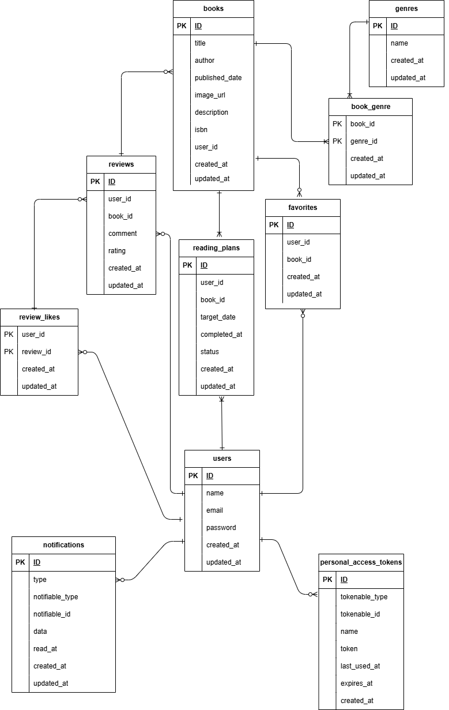

# BookShelf

BookShelfは、読書記録や読書計画を管理できるWebアプリケーションです。
書籍の登録・レビュー・お気に入り・ランキング・通知などの機能を備えています。
本プロジェクトでは、Laravelを用いたバックエンド開発を担当し、以下を実装しました。

- 提供されたBladeテンプレートを利用したバックエンド開発
- 書籍・レビュー・ジャンル・読書計画のCRUD機能実装
- 認証・認可機能の実装（Fortify・Policy）
- バリデーションの実装（FormRequest）
- 通知機能・バッチ処理の実装
- REST APIの実装
- PHPUnitによるテストコードの作成

## 使用技術

### バックエンド
- PHP 8.5.8
- Laravel 10.50.2

### データベース
- MySQL

### 認証
- Laravel Fortify
- Laravel Sanctum

### 開発環境
- Laravel Sail (Docker)
- Git / GitHub

### テスト
- PHPUnit

### フロントエンド（提供）
- Blade
- Tailwind CSS

## 機能一覧

| 機能 | 内容 |
|------|------|
| 認証 | ユーザー登録・ログイン・ログアウト |
| 書籍管理 | 書籍の登録・一覧・詳細・編集・削除 |
| レビュー | 投稿・編集・削除 |
| お気に入り | 書籍のお気に入り登録・解除 |
| ランキング | 評価順ランキング表示 |
| 読書計画 | 作成・編集・削除・期限管理 |
| 通知 | リマインダー通知・既読管理 |
| API | 書籍情報取得API |

## 環境構築

### 1. リポジトリのクローン

```bash
git clone https://github.com/aiwing001/bookshelf-app.git
cd bookshelf-app
```

### 2. Composerパッケージのインストール

以下のコマンドを実行し、Composerパッケージをインストールします。

```bash
docker run --rm \
-u "$(id -u):$(id -g)" \
-v "$(pwd):/var/www/html" \
-w /var/www/html \
-e COMPOSER_CACHE_DIR=/tmp/composer_cache \
laravelsail/php82-composer:latest \
composer install
```

### 3. `.env` ファイルを作成

`.env.example` をコピーして `.env` を作成します。

```bash
cp .env.example .env
```

`.env` のデータベース接続情報を以下の内容に変更します。

```env
DB_CONNECTION=mysql
DB_HOST=mysql
DB_PORT=3306
DB_DATABASE=laravel
DB_USERNAME=sail
DB_PASSWORD=password
```

### 4. Sailを起動

```bash
./vendor/bin/sail up -d --build
```

### 5. アプリケーションキーの生成

```bash
./vendor/bin/sail artisan key:generate
```

### 6. データベースのセットアップ

```bash
./vendor/bin/sail artisan migrate:fresh --seed
```

### 7. フロントエンドのセットアップ

フロントエンドの依存パッケージをインストールし、開発サーバーを起動します。

```bash
./vendor/bin/sail npm install
./vendor/bin/sail npm run dev
```

### 8. Google Books API の設定

ISBN検索機能を利用する場合は、Google Books API のAPIキーを取得し、`.env` に以下を追加してください。

```env
GOOGLE_BOOKS_API_KEY=あなたのAPIキー
```

`config/services.php` では以下のように設定しています。

```php
'google_books' => [
    'key' => env('GOOGLE_BOOKS_API_KEY'),
],
```

※ APIキーを設定しない場合、ISBN検索機能は利用できません。

## ER図



## APIエンドポイント一覧

| Method | Endpoint | 内容 |
| ------ | -------- | ---- |
| GET | /api/v1/books | 書籍一覧を取得 |
| GET | /api/v1/books/{book} | 書籍詳細を取得 |

## テスト

PHPUnitを使用して、Unitテスト・Featureテストを実施しています。

```bash
./vendor/bin/sail artisan test
```

### テスト用アカウント

動作確認には、Seederで作成される以下のアカウントをご利用ください。

- Email：`yamada@example.com`
- Password：`password`

※ 他にも複数のテストユーザーをSeederで作成しています。

### 通知機能の確認

読書計画の通知を確認する場合は、以下のコマンドを実行してください。

```bash
./vendor/bin/sail artisan app:check-reading-plans
```

※ 期日当日または3日前の読書計画が存在する場合、通知が生成されます。

## 工夫した点

- FormRequestでバリデーションを分離し、保守性を向上
- Policyによる認可で所有者のみ編集・削除可能とした
- Notificationとバッチ処理を組み合わせ、期限通知を自動化
- REST APIを実装し、JSON形式で書籍情報を取得可能にした
- Unitテスト・Featureテストを作成し、主要機能の動作を確認

## 開発環境URL

- http://localhost

## 作成者

- 持田 修司